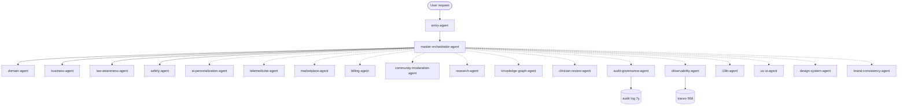
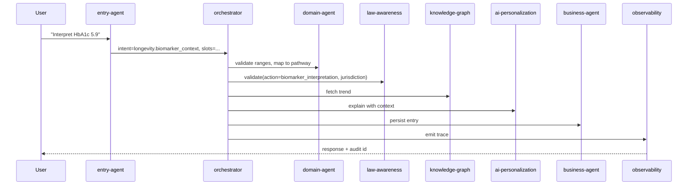

# AgeDefy AI — Platform Architecture

> Companion to the [README](README.md). Describes the layers, agent
> graph, data flow, intent taxonomy, and the SLOs each contract must meet.

## 1. Layered architecture

```
+-----------------------------+
|  Enterprise Layer           |  governance, retention, billing-of-record
|  Repo: .github-private      |
+--------------+--------------+
               |
               v
+-----------------------------+
|  AI Platform Layer          |  THIS REPO — agents, workflows, legal
|  Repo: agedefy-AI           |  rules, metadata, tooling
|  - agents/                  |
|  - workflows/               |
|  - tools/, tools-v3/        |
|  - schemas/                 |
+--------------+--------------+
               |
               v
+-----------------------------+
|  Product Layer              |  Next.js 15 app — see README-product.md
|  Repo: agedefy-app          |
+-----------------------------+
```

## 2. Agent graph (orchestrator topology)



## 3. Sequence — biomarker interpretation



## 4. Data flow

| Surface       | Source of truth                                  |
|---------------|---------------------------------------------------|
| Intents       | [metadata/intents.yml](metadata/intents.yml)      |
| Compounds     | [metadata/compounds.yml](metadata/compounds.yml)  |
| Pathways      | [metadata/pathways.yml](metadata/pathways.yml)    |
| Biomarkers    | [metadata/biomarkers.yml](metadata/biomarkers.yml)|
| Lab panels    | [metadata/lab_panels.yml](metadata/lab_panels.yml)|
| Products      | [metadata/products.yml](metadata/products.yml)    |
| Legal rules   | [agents/legal-rules/](agents/legal-rules/)        |
| Jurisdictions | [jurisdictions/index.yml](jurisdictions/index.yml)|
| Workflows     | [workflows/](workflows/)                          |
| Agents        | [agents/](agents/)                                |
| Schemas       | [schemas/](schemas/)                              |
| Traces        | `./traces/orchestrator.jsonl`                     |

## 5. Feature ↔ workflow ↔ agent matrix

| Product feature (README) | Workflow | Primary agent(s) |
|---|---|---|
| Biomarker tracking | `biomarker_interpretation_workflow` | domain, knowledge-graph, ai-personalization |
| Protocol engine | `protocol_recommendation_workflow` | business, safety, clinician-review |
| Knowledge graph | `knowledge_graph_workflow` | knowledge-graph |
| Compound mixer | `compound_interaction_workflow` | knowledge-graph, safety |
| Lab testing | `lab_order_workflow` | business, billing, law-awareness |
| Telemedicine | `telemedicine_routing_workflow` | telemedicine, law-awareness |
| Marketplace | `marketplace_purchase_workflow` | marketplace, safety, billing |
| Stripe billing | `subscription_billing_workflow` | billing |
| Community forum | `community_moderation_workflow` | community-moderation, safety |
| Learning center | `learning_content_workflow` | brand-consistency, business |
| Clinical trials | `clinical_trial_search_workflow` | research |
| Research hub | `research_ingestion_workflow` | research, knowledge-graph |
| AI personalization | `ai_personalization_workflow` | ai-personalization, safety, audit-governance |
| Global search | `global_search_workflow` | knowledge-graph, ai-personalization |
| Admin GDPR | `account_gdpr_workflow` | audit-governance |
| Admin audit | `admin_audit_workflow` | audit-governance |
| i18n | `i18n_resolution_workflow` | i18n |

## 6. Tracing & observability

Every agent emits a JSONL record to `./traces/orchestrator.jsonl` matching
[schemas/trace.schema.json](schemas/trace.schema.json). Replay any past
run with `./tools/replay-trace.ps1 -RunId <id>`. Metrics export as
Prometheus textfile.

## 7. Maturity targets (toward Level 5)

| Dimension       | Current target |
|-----------------|----------------|
| Schemas         | L5 — every YAML validated in CI |
| Content         | L4 — real legal rules, citations, freshness gate |
| Agents          | L4 — name/version/owners/SLA/error_handling on every agent |
| Workflows       | L4 — one workflow per product module |
| Tooling         | L4 — full menu wired, `-Help`/`-WhatIf` everywhere |
| Tests           | L4 — Pester ≥ 80% + golden + redteam + eval |
| Observability   | L4 — JSONL traces + replay + metrics |
| Governance      | L4 — CODEOWNERS, SECURITY, signed releases |
| Continuous improvement | L5 — drift detection, eval regression budget |

