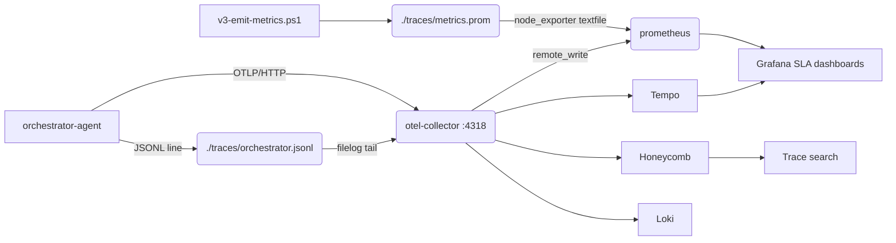

# Observability — Trace + Metric Pipeline

This folder wires the AgeDefy AI agent graph to a real telemetry backend.



## Environment contract

Set these (CI: GitHub Actions secrets; runtime: pod env / Vault):

| Var | Purpose |
| --- | --- |
| `TEMPO_OTLP_ENDPOINT` | gRPC endpoint of Grafana Tempo / Jaeger |
| `TEMPO_AUTH_HEADER` | `Authorization` header value (e.g. `Bearer ...`) |
| `HONEYCOMB_API_KEY` | Honeycomb ingest key (dataset `agedefy-ai`) |
| `PROM_REMOTE_WRITE_URL` | Prometheus / Mimir remote-write URL |
| `PROM_AUTH_HEADER` | `Authorization` header value |
| `LOKI_ENDPOINT` | Loki push endpoint (`/loki/api/v1/push`) |
| `LOKI_TENANT` | Loki org-id |
| `AGEDEFY_ENV` | `dev` / `staging` / `production` |

## Local dev

```pwsh
docker run --rm -p 4317:4317 -p 4318:4318 -p 13133:13133 `
  -v ${PWD}/observability/otel-collector.yml:/etc/otel/config.yaml `
  -v ${PWD}/traces:/var/log/agedefy/traces `
  otel/opentelemetry-collector-contrib:0.110.0 `
  --config /etc/otel/config.yaml
```

Then run an eval pass to generate trace lines:

```pwsh
./tools-v3/v3-trace-otlp-exporter.ps1 -Tail
```

## SLA dashboards

`observability/dashboards/agedefy-sla.json` (Grafana) plots, per agent:

- `agedefy_agent_latency_ms{quantile="0.5"}` (p50)
- `agedefy_agent_latency_ms{quantile="0.99"}` (p99)
- `rate(agedefy_agent_decisions_total{decision="block"}[5m])` (block rate)
- `agedefy_legal_rules_stale` (compliance freshness)

Alert rules: `observability/alerts/sla.alerts.yml`.
